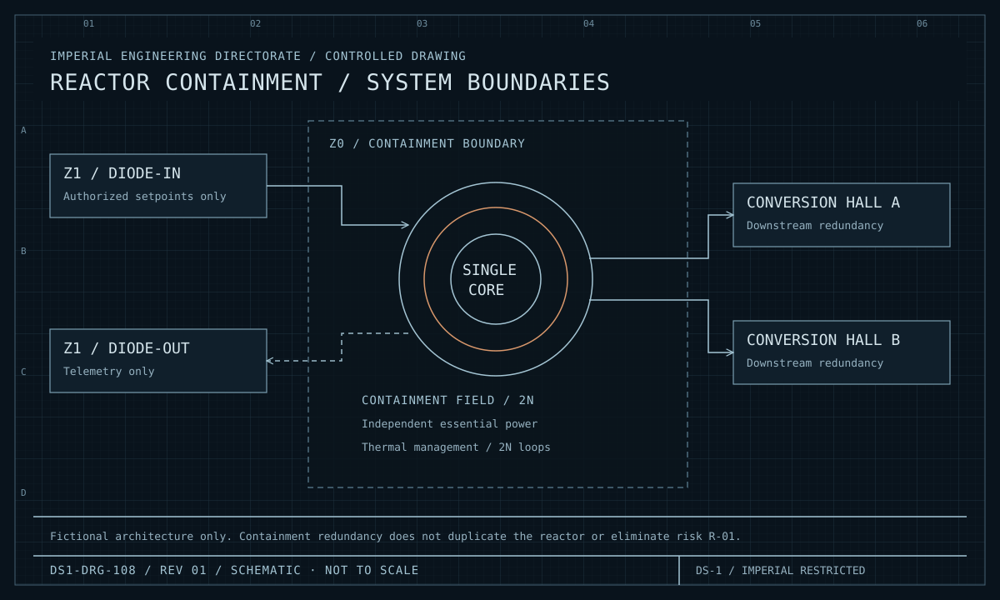
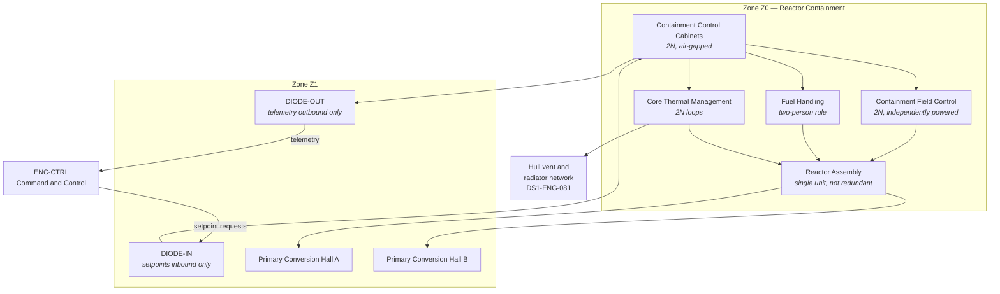

| Document ID | Classification | System | Document Owner | Status |
|---|---|---|---|---|
| `DS1-ENG-020` | IMPERIAL RESTRICTED | DS-1 Orbital Battle Station | Reactor Systems Authority | Operational / Controlled Document |

ACCESS: AUTHORIZED ENGINEERING PERSONNEL ONLY &middot; Unauthorized access will be logged and escalated to Sector Security Command.

# Power Generation

!!! danger "Scope limitation — read before proceeding"

    This document describes the reactor assembly **only at the architectural
    level**: its interfaces, control authority, zone placement, operating states,
    failure modes and the constraints it imposes on the rest of the platform.

    It contains no constructional detail, no material or fuel specification, no
    energy formulation, and no assembly, start-up or commissioning procedure.
    That material is held by the Reactor Systems Authority under separate
    classification and a separate access path. Requests are made through your
    System Authority. **Requests made through this library are refused and
    recorded.**

## 1. Purpose and Scope

Power Generation converts hypermatter reaction output into a single coherent
supply presented to the Primary Conversion Halls. It is the platform's sole
primary energy source.

**In scope:** the reactor assembly, its containment field control, fuel handling,
the `Z0` control cabinets and the two data diodes forming its only network
connection.

**Out of scope:** distribution beyond the Primary Conversion Halls
([Power Distribution](power-distribution.md)); the standby generation set, which
is deliberately *not* part of this system.

## 2. Decomposition

<figure class="blueprint" markdown>

<figcaption>DS1-DRG-108 · Reactor containment / system boundaries · Rev 01 · Schematic, not to scale</figcaption>
</figure>

The redundancy boundary begins at conversion. Independent containment controls protect the single fictional core but do not provide a second source.

| Element | Redundancy | Note |
|---|---|---|
| Reactor Assembly | **None** | Forbidden by `C-T-01`; see [ADR-001](../decisions/adr-001-single-core-reactor.md) |
| Containment Field Control | 2N | Independently powered from the essential bus, not from the reactor |
| Containment Control Cabinets | 2N | Air-gapped; reachable only through the diodes |
| Core Thermal Management | 2N loops | Loss of both is the initiating condition for reactor scram |
| Fuel Handling | Single, two-person rule | Not a continuous-duty system |
| Primary Conversion Halls | 2N | The redundancy boundary begins here, not before it |

## 3. Interfaces

| ID | Peer | Direction | Content |
|---|---|---|---|
| `IX-CORE` | Command and Control | **In only** | Setpoint requests via `DIODE-IN`. No acknowledgement traverses this path. |
| `IX-CORE-T` | Command and Control | **Out only** | Containment state, thermal state, output state via `DIODE-OUT` |
| `IX-GEN` | Power Distribution | Out | Converted output at the Primary Conversion Halls |
| `IX-ENV` | Life Support (thermal) | Out | Core heat load presented to the vent network |

**The absence of a bidirectional path is the defining property of this system.**
A setpoint request enters and is acted upon or refused locally. Confirmation
arrives as a *changed telemetry value* on a physically separate path, not as a
protocol acknowledgement. Every consumer of `IX-CORE` is written to that
contract.

## 4. Operating States and Degradation

```mermaid
stateDiagram-v2
    [*] --> SUSTAIN

    SUSTAIN: SUSTAIN
    SUSTAIN: Steady output at commanded setpoint
    SUSTAIN: Normal operating state

    ELEVATED: ELEVATED
    ELEVATED: Output raised for propulsion or
    ELEVATED: armament charge; thermal margin reduced
    ELEVATED: Time-limited by thermal budget

    THROTTLED: THROTTLED
    THROTTLED: Output reduced on thermal or
    THROTTLED: containment margin; automatic
    THROTTLED: Non-essential load shed follows

    HOLD: HOLD
    HOLD: Setpoint frozen; no change accepted
    HOLD: Entered on loss of DIODE-IN
    HOLD: Local Z0 authority under two-person rule

    SCRAM: SCRAM
    SCRAM: Reaction terminated
    SCRAM: Essential bus on standby generation
    SCRAM: Recovery is a multi-day authorized evolution

    SUSTAIN --> ELEVATED: Authorized demand
    ELEVATED --> SUSTAIN: Demand ends or time limit reached
    ELEVATED --> THROTTLED: Thermal margin breached
    SUSTAIN --> THROTTLED: Thermal or containment margin breached
    THROTTLED --> SUSTAIN: Margin recovered
    SUSTAIN --> HOLD: DIODE-IN lost
    ELEVATED --> HOLD: DIODE-IN lost
    HOLD --> SUSTAIN: DIODE-IN restored, setpoint reconciled
    THROTTLED --> SCRAM: Margin not recoverable
    HOLD --> SCRAM: Local authority determines scram necessary
    SCRAM --> [*]: Restart requires Imperial Engineering Command approval
```

| Transition | Authority | Reversible |
|---|---|---|
| `SUSTAIN` → `ELEVATED` | Overbridge, authorized directive | Yes |
| Any → `THROTTLED` | **Automatic**, no human in the loop | Yes |
| Any → `HOLD` | **Automatic** on `DIODE-IN` loss | Yes |
| Any → `SCRAM` | Automatic, or local `Z0` authority under the two-person rule | **No** — restart is a multi-day evolution requiring Imperial Engineering Command approval |

`SCRAM` is not commandable from the Overbridge. It is a local protective action.
This was contested at design review and settled deliberately: a remotely
commandable scram is a remotely commandable platform kill.

## 5. Redundancy and Failure Domains

This system holds the only `○` (partial conformance) against
[CC-5](../architecture/crosscutting-concepts.md#cc-5-redundancy-and-failure-domains)
in the platform. It cannot be made redundant.

What is provided **instead of** redundancy — and is explicitly not equivalent to it:

| Substitute measure | What it achieves | What it does not achieve |
|---|---|---|
| Containment field, 2N, independently powered | Contains a reaction excursion | Does not keep the platform powered |
| Physical isolation of `Z0` behind a two-person boundary | Removes the insider actuation path | Does not remove the structural target |
| Diode-only connectivity | Removes the remote actuation path | Does not remove the physical one |
| Standby generation on the essential bus | Keeps life support and C2 alive after `SCRAM` | Sustains life, not capability; hours to days, not indefinitely |
| Thermal margin governance | Prevents the most probable path to `SCRAM` | Does not address deliberate attack |

The residual is [R-01](../risks/risk-register.md), the platform's dominant risk.
It is accepted at Imperial High Command level, not at Directorate level.

## 6. Observability

| Signal | Class | Path | Interval |
|---|---|---|---|
| Containment field integrity | State | `DIODE-OUT` | 100 ms |
| Core thermal margin | Measurement | `DIODE-OUT` | 1 s, trended continuously |
| Output state and setpoint conformance | State | `DIODE-OUT` | 1 s |
| Fuel handling activity | Event | `DIODE-OUT` | Push, two-party attributed |
| `Z0` boundary transits | Event | `ENC-CTRL` via BCP | Push |
| Diode health, both directions | State | Both | 1 s; loss of either is immediately actionable |

Thermal margin is the platform's leading indicator. Every `THROTTLED` transition
in the last two years was preceded by a trending margin reduction visible for
more than an hour. This is the single most valuable measurement on the platform.

## 7. Maintenance

- Containment field control is maintained **one instance at a time**, never both,
  and never during `ELEVATED`.
- Thermal loops are maintained one loop at a time, with the reactor `THROTTLED`
  for the duration and the readiness reduction declared in advance.
- The reactor assembly itself cannot be maintained in service. Assembly-level
  work requires a full down-state, which has occurred twice since commissioning.
- Diode replacement takes the platform to `HOLD` for the duration. This is
  scheduled, announced and rehearsed.
- `Z0` work packets are issued and closed under the two-person rule throughout;
  a single-person `Z0` entry is a Class-1 security event regardless of intent.

## 8. Known Deficiencies

| Ref | Deficiency | Impact | Status |
|---|---|---|---|
| `TD-09` | Core thermal instrumentation in two of eight sectors dates from the construction phase and reports at reduced resolution. | Reduced early warning in those sectors; margin must be managed conservatively. | Replacement scheduled in the next major window |
| `TD-10` | `HOLD` reconciliation on `DIODE-IN` restoration is manual and takes approximately 40 minutes. | Extended reduced-capability period after a diode event. | Automation in design; blocked on `PREPROD` reference-node availability (`TD-04`) |
