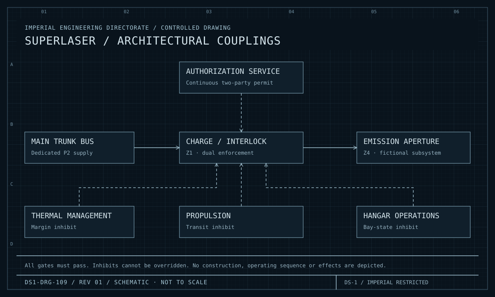
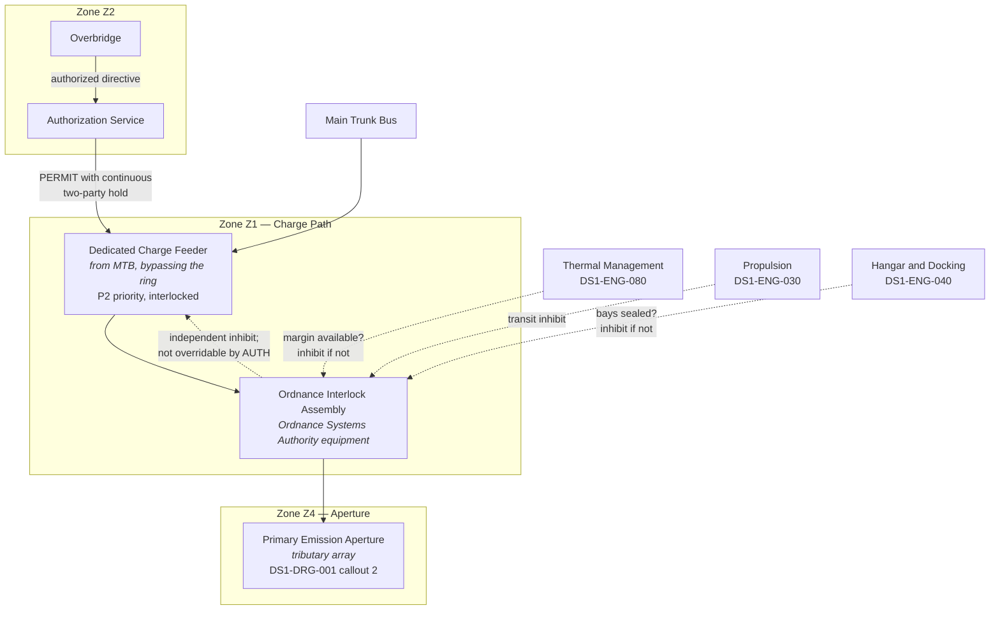

| Document ID | Classification | System | Document Owner | Status |
|---|---|---|---|---|
| `DS1-ENG-110` | IMPERIAL RESTRICTED | DS-1 Orbital Battle Station | Ordnance Systems Authority | Operational / Controlled Document |

ACCESS: AUTHORIZED ENGINEERING PERSONNEL ONLY &middot; Unauthorized access will be logged and escalated to Sector Security Command.

# Primary Armament — Architectural Description

!!! danger "Scope limitation — read before proceeding"

    This document describes the primary armament **only as an architectural
    element**: its control authority, its interlock chain, its zone placement,
    its power and thermal relationships with the rest of the platform, and its
    failure and refusal behaviour.

    It contains **no** design, construction, materials, energy, targeting,
    sequencing or effects detail of any kind, and no procedure by which the
    system is operated. That material is held exclusively by the Ordnance
    Systems Authority under separate classification and a separate access path.
    Requests are made through your System Authority. **Requests made through
    this library are refused and recorded.**

    Personnel requiring only to understand the armament's *effect on their own
    system* — its power draw, thermal load, interlock demands or readiness
    coupling — will find that here, and need nothing further.

## 1. Why This Page Exists

The armament is not architecturally interesting for what it does. It is
architecturally interesting because of what it demands of everything else:

- It is the reason generation cannot be distributed (`C-T-01`), which is the
  origin of the platform's dominant risk.
- Its charge feeder is one of only two dedicated feeders bypassing the quadrant
  ring buses.
- Its thermal load is the largest transient the rejection system must absorb.
- Its interlock chain reaches into propulsion, hangar operations, life support
  and readiness state.

A propulsion or life support engineer needs to understand those couplings. They
do not need, and will not be given, anything else.

## 2. Architectural Placement

<figure class="blueprint" markdown>

<figcaption>DS1-DRG-109 · Superlaser / architectural couplings · Rev 01 · Schematic, not to scale</figcaption>
</figure>

This fictional interface plate shows only dependencies and independent inhibits. It specifies no mechanism, construction or operating procedure.

## 3. The Interlock Chain

The authorization chain is specified in
[RV-7](../architecture/runtime-view.md#rv-7-primary-armament-authorization-interlock-chain).
Its architectural properties:

| Property | Statement |
|---|---|
| **Conjunctive** | Every gate must pass. There is no override, no quorum substitution, no emergency bypass. |
| **Fail-closed** | A gate that cannot be evaluated counts as failed. Unreachable is not permissive. |
| **Dual-enforced** | Both the Authorization Service and the Ordnance Interlock Assembly enforce independently. Neither alone is sufficient, and neither can override the other. |
| **Continuous** | The charge feeder is held open by continuous two-party action, not by a single event. Release of either hold reverts the feeder immediately. |
| **Externally inhibited** | Thermal Management, Propulsion and Hangar Operations each hold an independent inhibit. Any of them may prevent charge; none of them may permit it. |
| **Fully logged** | Every refusal is recorded with a reason code and reported to the originator. Refusal rates are trended per gate. |

!!! note "Why refusals are trended"

    A rising refusal rate at a particular gate is treated as a **defect
    indication in that gate's inputs**, not as operator error. Two of the three
    interlock defects found since commissioning were identified this way, before
    they were identified any other way. This is [CC-7](../architecture/crosscutting-concepts.md#cc-7-human-factors-and-command-ergonomics)
    applied to a system where the cost of a wrong answer is unbounded.

## 4. Couplings on Other Systems

What every other System Authority needs to know:

| System | Coupling | Consequence for that system |
|---|---|---|
| [Power Generation](power-generation.md) | Charge demand drives the reactor to `ELEVATED` | Thermal margin reduced; `ELEVATED` is time-limited |
| [Power Distribution](power-distribution.md) | Dedicated `P2` feeder from the trunk bus | Feeder is shed at `LSD-1` stage 3 unless an interlocked hold is in force |
| [Life Support](life-support.md) | Largest single transient thermal load on the platform | `THERMAL-LIMITED` inhibits charge; this inhibit is not overridable |
| [Propulsion](propulsion.md) | Charge state must be zero and interlocked before `TRANSIT-PREP` completes | Transit gate fails if charge state is non-zero |
| [Hangar and Docking](hangar-and-docking.md) | All bays must be sealed before charge is released | Bay state is an armament interlock input |
| [Command and Control](command-and-control.md) | Requires ORL-4 or above, plus two-party continuous hold | Readiness level is an armament gate |

## 5. Operating States

| State | Meaning |
|---|---|
| `SAFE` | Feeder isolated, interlocks engaged. **Default and normal state.** |
| `ARMED` | Authorization chain satisfied; feeder available but not released |
| `CHARGING` | Feeder released under continuous two-party hold |
| `INHIBITED` | One or more external inhibits in force; feeder cannot be released regardless of authorization |
| `FAULT` | Interlock assembly fault; reverts to `SAFE` and cannot leave it until cleared |

Transitions toward `SAFE` are automatic and immediate. Transitions away from
`SAFE` require the full conjunctive chain. `FAULT` is a one-way transition to
`SAFE`.

## 6. Observability

Available to the general engineering population:

| Signal | Class | Notes |
|---|---|---|
| Armament state (`SAFE`/`ARMED`/`CHARGING`/`INHIBITED`/`FAULT`) | State | Displayed permanently at the Overbridge |
| Inhibit sources currently in force | State | Each system can see whether *its own* inhibit is asserted |
| Charge feeder breaker position | State | Part of the power distribution picture |
| Thermal load presented | Measurement | Part of the thermal picture |
| Refusals by gate and reason code | Event | Trended; visible to the Architecture Authority |

Everything else — the internals of the interlock assembly, and all operational
detail — is held by the Ordnance Systems Authority and is not visible here.

## 7. Maintenance

Maintenance of this system is performed exclusively by Ordnance Systems Authority
personnel under their own procedures, which are not held in this library.

Architecturally binding constraints on that work:

- The system is in `SAFE` for the entire duration. There is no live-charge
  maintenance.
- The dedicated feeder is isolated and proved dead at the trunk bus, under a
  declared maintenance window.
- Interlock assembly work requires the platform below ORL-4.
- **No armament maintenance may be concurrent with propulsion transit
  preparation.** Both consume the same interlock inputs and the combination has
  produced a contradictory state once, during commissioning.

## 8. Known Deficiencies

| Ref | Deficiency | Impact | Status |
|---|---|---|---|
| `TD-27` | The thermal inhibit input is sampled at 1 s, coarser than the 100 ms thermal measurement it derives from. | A fast thermal excursion could in principle be missed for up to one second at the inhibit. | Sampling uplift approved; Ordnance Systems Authority implementing |
