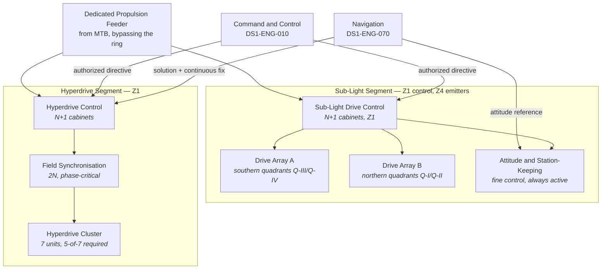

| Document ID | Classification | System | Document Owner | Status |
|---|---|---|---|---|
| `DS1-ENG-030` | IMPERIAL RESTRICTED | DS-1 Orbital Battle Station | Propulsion Systems Authority | Operational / Controlled Document |

ACCESS: AUTHORIZED ENGINEERING PERSONNEL ONLY &middot; Unauthorized access will be logged and escalated to Sector Security Command.

# Propulsion

## 1. Purpose and Scope

Propulsion provides platform mobility in two distinct regimes: sub-light
manoeuvring for station-keeping, orbital positioning and evasion, and hyperdrive
transit for repositioning between systems.

**In scope:** the sub-light drive array, the hyperdrive cluster, drive control,
the propulsion power interface and the transit-mode governance.

**Out of scope:** the navigation solution ([Navigation](navigation.md)); embarked
craft propulsion.

## 2. Decomposition

| Element | Count | Redundancy | Note |
|---|---|---|---|
| Sub-light drive arrays | 2 | Either array alone provides manoeuvring at reduced rate | Physically opposed, northern and southern |
| Sub-light drive control | 2 cabinets | N+1 | Z1, separate compartments |
| Attitude and station-keeping | Distributed | N+2 | Continuously active; never fully shut down |
| Hyperdrive units | 7 | **5-of-7 required for transit** | See [ADR-006](../decisions/adr-006-hyperdrive-cluster.md) |
| Field synchronisation | 2 | 2N | Phase-critical; loss of both aborts transit |
| Hyperdrive control | 2 cabinets | N+1 | Z1, separate compartments |

## 3. Interfaces

| ID | Peer | Direction | Content |
|---|---|---|---|
| `IX-CMD` | Command and Control | In | Manoeuvre and transit directives, scoped and time-boxed |
| `IX-NAV` | Navigation | In | Transit solution, continuous position fix, attitude reference |
| `IX-PWR-P` | Power Distribution | In | Dedicated feeder, `P2` priority, bypassing the quadrant rings |
| `IX-TLM` | Command and Control | Out | Drive state, cluster availability, transit-readiness gates |
| `IX-STR` | Structures | In | Structural loading limits and current structural state |

The dedicated feeder is architecturally significant: propulsion demand is large
and intermittent, and routing it through a quadrant ring would couple manoeuvring
transients into sector supply. It is fed from the trunk bus directly.

## 4. Operating Modes and Degradation

| Mode | Condition | Behaviour |
|---|---|---|
| `STATION-KEEPING` | Default | Attitude control active, drive arrays idle |
| `MANOEUVRE` | Authorized directive | One or both arrays active, subject to structural limits |
| `TRANSIT-PREP` | Authorized transit directive | Preparation gates evaluated; see [RV-3](../architecture/runtime-view.md#rv-3-hyperspace-transit-preparation-and-execution) |
| `TRANSIT` | All gates passed, quiescence confirmed by 72 sectors | Hyperdrive engaged; platform in transit configuration |
| `DEGRADED-SL` | One drive array lost | Manoeuvring at reduced rate; attitude unaffected |
| `NO-TRANSIT` | Fewer than 5 hyperdrive units, or both synchronisation channels lost | Transit unavailable; sub-light unaffected |
| `EMERGENCY-REVERSION` | Structural or containment alarm during transit | Immediate reversion to realspace at the current point |

!!! warning "Transit is not a background activity"

    Constraint `C-T-05` requires structural and electrical quiescence during
    transit. A transit therefore suspends `IF-01`, `IF-03` and `IF-06`, places
    all 72 sector nodes in `DETACHED`, sheds to `P3` and drives armament charge
    state to zero. **The platform is at its least capable while it is moving.**
    This is unavoidable and is a standing consideration in operational planning.

## 5. Redundancy and Failure Domains

| Pair | Separated by |
|---|---|
| Drive array A / B | Opposite hemispheres; independent structural mounting |
| Drive control cabinets | Separate `Z1` compartments, separate distribution boards |
| Hyperdrive units | Distributed across the ventral bay in two groups of 3 and one of 1 |
| Synchronisation channels | Separate compartments, separate essential bus sides |

The 5-of-7 hyperdrive arrangement means two units may be lost or under
maintenance with transit capability retained. It also means a *third* loss
removes mobility entirely while leaving the platform otherwise fully functional —
a degradation mode which has no automatic mitigation and is accepted. See
[ADR-006](../decisions/adr-006-hyperdrive-cluster.md).

## 6. Observability

| Signal | Class | Interval |
|---|---|---|
| Hyperdrive unit availability, per unit | State | 1 s; the count is displayed permanently at the Overbridge |
| Synchronisation channel phase error | Measurement | 100 ms; the leading indicator for transit abort |
| Drive array thermal and structural loading | Measurement | 1 s |
| Transit gate status, all gates | State | On demand, and continuously during `TRANSIT-PREP` |
| Sector quiescence confirmations, 72 of 72 | State | During `TRANSIT-PREP` only |
| Transit aborts by cause | Event | Push; trended monthly |

## 7. Maintenance

- Hyperdrive units are maintained one at a time, never two, and never with
  availability already below 6.
- Synchronisation channel work is single-channel only and prohibits transit for
  the duration.
- Drive array maintenance takes the platform to `DEGRADED-SL` with the readiness
  reduction declared in advance.
- Attitude and station-keeping is **never** fully out of service. Its `N+2`
  arrangement exists specifically so that maintenance never reduces it below `N`.

## 8. Known Deficiencies

| Ref | Deficiency | Impact | Status |
|---|---|---|---|
| `TD-13` | Transit abort rate is 22 per cent, dominated by sector quiescence confirmation timeouts rather than genuine non-quiescence. | Operational unpredictability; transit planning must assume roughly one abort per two attempts. | Root cause traced to `TD-03` reconciliation latency; remediation is common to both |
| `TD-14` | Hyperdrive unit 4 has operated on a temporary mounting arrangement since commissioning under [ADR-008](../decisions/adr-008-live-commissioning.md). | Unit 4 carries a reduced structural allowance and is first to be de-rated under load. | Permanent mounting requires a full down-state; scheduled but not dated |
