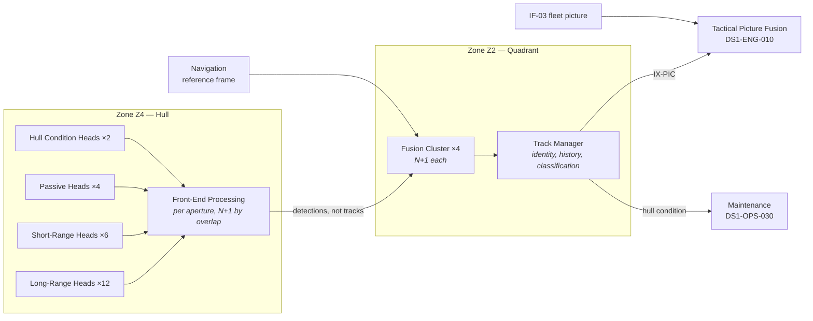

| Document ID | Classification | System | Document Owner | Status |
|---|---|---|---|---|
| `DS1-ENG-060` | IMPERIAL RESTRICTED | DS-1 Orbital Battle Station | Control Systems Authority | Operational / Controlled Document |

ACCESS: AUTHORIZED ENGINEERING PERSONNEL ONLY &middot; Unauthorized access will be logged and escalated to Sector Security Command.

# Sensors

## 1. Purpose and Scope

Sensors detect, classify and track objects in the platform's operating volume,
and monitor the platform's own external condition.

**In scope:** 24 hull apertures and their front ends, the four fusion clusters,
track management, and the internal hull-condition sensing that shares the
aperture budget.

**Out of scope:** the tactical picture as consumed by command
([Command and Control](command-and-control.md) holds Tactical Picture Fusion);
internal environmental sensing ([Life Support](life-support.md)).

## 2. The Aperture Budget

Every sensor aperture penetrates the hull, and every penetration is a structural
and security discontinuity (`C-T-06`). The aperture count is therefore a
**governed budget**, not a design free variable.

| Allocation | Apertures | Rationale |
|---|---|---|
| Long-range detection | 12 | Full spherical coverage with N+1 overlap |
| Short-range and approach | 6 | Concentrated on the equatorial hangar belt |
| Passive listening | 4 | Distributed; used during transit when active emission is prohibited |
| Hull condition | 2 | Shared, low bandwidth |
| **Total** | **24** | **Fixed.** Any increase requires Imperial Engineering Command approval |

A proposal that requires a new aperture must either displace an existing
allocation or be refused. This has refused four capability proposals since
commissioning; the refusals are recorded.

## 3. Decomposition

**Front ends emit detections, not tracks.** Track formation happens once, in the
fusion cluster, against a single reference frame. This prevents the same object
appearing as several tracks from several apertures — a failure that produced two
false engagement warnings during commissioning.

## 4. Interfaces

| ID | Peer | Direction | Content |
|---|---|---|---|
| `IX-PIC` | Command and Control | Out | Tracks, classifications, confidence |
| `IX-NAV` | Navigation | In | Reference frame |
| `IX-CMD` | Command and Control | In | Emission control directives, search tasking |
| `IX-TLM` | Command and Control | Out | Aperture availability, coverage gaps, hull condition |

## 5. Operating Modes and Degradation

| Mode | Condition | Behaviour |
|---|---|---|
| `ACTIVE` | Default at ORL-3 and above | Full emission, full coverage |
| `PASSIVE` | Transit, or emission control directive | Passive heads only; detection range materially reduced |
| `SILENT` | Emission control, covert posture | No emission whatsoever; passive heads on minimum gain |
| `DEGRADED-COVERAGE` | Aperture losses have opened a coverage gap | Gap reported explicitly by bearing and elevation; **never silently interpolated** |

!!! warning "Coverage gaps are reported, never inferred away"

    When apertures are lost, the fusion cluster reports the resulting gap by
    bearing and elevation. It does not extrapolate a plausible picture across
    the gap. An operator looking at a sensor display must be able to tell the
    difference between "nothing is there" and "we cannot see there". Conflating
    the two is the mechanism behind most surprise in this domain.

## 6. Redundancy and Failure Domains

| Element | Redundancy | Separation |
|---|---|---|
| Long-range apertures | N+1 by coverage overlap | Distributed across all four quadrants |
| Fusion clusters | N+1 within each quadrant | Separate `Z2` compartments |
| Front ends | One per aperture, no local redundancy | Redundancy is by *coverage*, not by duplication |

Front ends deliberately have no local redundancy: an aperture is already a
structural compromise, and doubling the electronics behind it does not address
the aperture's own vulnerability. The redundancy is the overlapping aperture.

## 7. Observability

| Signal | Class | Interval |
|---|---|---|
| Aperture availability, per aperture | State | 1 s |
| Coverage gap map | State | 1 s; rendered on the Overbridge picture as an explicit exclusion |
| Track count and formation rate | Measurement | 1 s |
| Detection-to-track latency | Measurement | Continuous; trended |
| Emission state | State | 1 s; must agree with the current emission control directive or it alarms |

## 8. Maintenance

- Aperture maintenance is `Z4` hull work under a declared window with the
  resulting coverage gap published in advance to Fleet Command.
- Never more than one aperture per coverage overlap group at a time.
- Fusion cluster maintenance runs on the `N+1` partner within the quadrant.
- Passive head calibration requires `SILENT` and is therefore scheduled with
  operational rather than engineering priority.

## 9. Known Deficiencies

| Ref | Deficiency | Impact | Status |
|---|---|---|---|
| `TD-16` | Detection-to-track latency in quadrant `Q-IV` is roughly double the platform figure, traced to an older fusion cluster generation never uplifted. | Slower track formation on one quadrant's approaches. | Uplift approved, blocked on window availability |
| `TD-17` | Two long-range heads share a distribution board contrary to CC-5, a construction-phase economy. | A single board fault opens a coverage gap that the overlap arrangement was designed to prevent. | Re-feed designed; requires `Z1` cable work in a major window |
